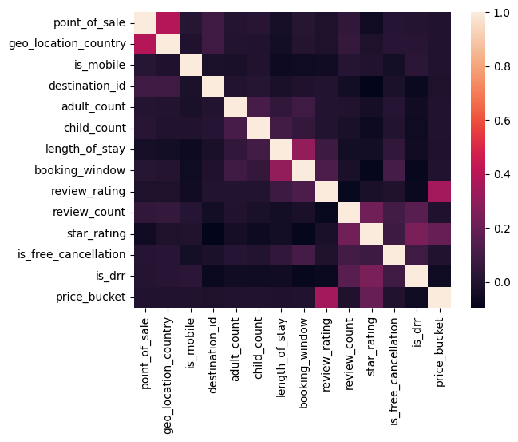
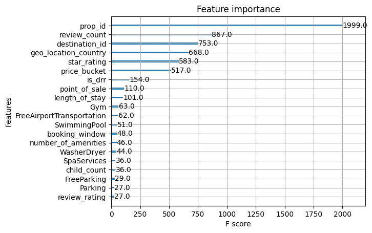
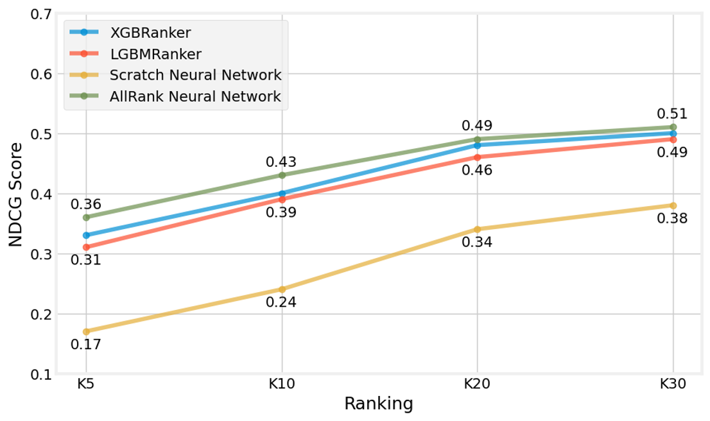

# AI-Powered Hotel Ranking: Streamlining Your Booking Experience

## Project Description
Expedia Group, a prominent online travel agency, streamlines trip planning by providing a platform where users can compare prices, review amenities, and book accommodations through sophisticated recommendation and ranking systems. This project evaluates various machine learning models to efficiently prioritize the most relevant search results, enhancing user satisfaction and booking efficiency.

## Partners
- Expedia Group
- Constructor Academy

## Table of Contents
1. [Problem Statement](#problem-statement)
2. [Project Goal](#project-goal)
3. [Dataset Description](#dataset-description)
4. [Approach and Methodology](#approach-and-methodology)
   - [Machine Learning Models](#machine-learning-models)
   - [Deep Learning Models](#deep-learning-models)
5. [Results](#results)
6. [Future Work](#future-work)
7. [Team Members](#team-members)
8. [Additional Resources](# Dive deeeper into Our Project)
9. [Tools Used](#tools-used)


## Problem Statement
When searching for accommodations, users face an overwhelming number of choices. For example, searching for a "4-star hotel for three adults in Geneva in early May 2024" can yield hundreds of results. Without sorting options based on user-specified features like star rating or number of guests, search times can extend, and bookings can decrease, countering the platform’s objective to simplify travel arrangements.

## Project Goal
The goal of this project is to develop and evaluate supervised machine learning and deep learning models that can rank hotel search results by relevance, thereby improving user satisfaction and booking rates.

## Evaluation Metric

Normalized Discounted Cumulative Gain (NDCG) is a ranking quality metric that compares rankings to an ideal order where all relevant items are at top of the list. NDCG shows how relevance of items decreases as their position in the ranking increases 

|  |  |
|:----------------------------------------:|:----------------------------------------:|
| Figure 1:  NDCG as a ranking quality metric         | Figure 2:     Relevance decreases with rank    |

## Dataset Description
The Expedia RecTour research dataset used in this project includes 1 million searches over two months in 2021. It contains detailed information on booking details, hotel ratings, review counts, and amenities such as WiFi and parking. We focused on searches that led to clicks or bookings for the top 500 destinations, which helped us significantly reduce the training dataset size.

|  |
|:--------------------------------------------------------------------------------------------------------:|
| **Figure 3: Correlation Matrix**                                                      |


**Table1: Key Correlations**

| Correlation Type      | Features Involved               | Description                                                            |
|-----------------------|---------------------------------|------------------------------------------------------------------------|
| **High Correlation**  | Review Count, Review Rating     | Properties with more reviews tend to have consistent ratings.           |
| **High Correlation**  | Length of Stay, Booking Window  | Longer stays are planned further in advance.                            |
| **Moderate Correlation** | Star Rating, Review Rating     | Higher star ratings are generally associated with better reviews.       |
| **Moderate Correlation** | Price Bucket, Star Rating       | Higher star ratings are associated with higher price buckets.           |
| **Low/No Correlation** | Is Mobile, Most Other Variables | Mobile bookings are not strongly related to other features.             |
| **Low/No Correlation** | Child Count, Most Other Variables | The number of children doesn't significantly impact other features.      |
| **Negative Correlation** | Is Free Cancellation, Price Bucket | Higher-priced properties are less likely to offer free cancellation.     |


## Data preprocessing and Feature selection

Refer to doc "Feature_Selection_Documentation.md" within 'docs' folder for further details
 
- Categorical Features: Target encoding for high-cardinality features.
- Binary Features: One-hot encoding and retention of relevant indicators.
- Ordinal Features: Handling of ratings and rankings.
- Numerical Features: Standard scaling applied.
- Excluded Features: Features used solely for relevance labeling and those with majority null values.

## Feature engineering based upon business logic
Notebook "FeatureEngineeringNewTargetRelevances.ipynb," creates custom features to enhance target relevance. Key steps include:

- Relevance Calculation: Based on user clicks and transactions.
- Categorization: For price buckets and review ratings.
- Combined Features: Integrates clicks, price, ratings, and review counts.
- Target Encoding: Encodes categorical based upon selected/targetrelevance.
- Feature Selection: Chooses and retains the most relevant features.

The saved data can be used for next steps for model training and evaluation

## Machine Learning Models
We began with decision tree-based models such as LightGBM and XGBRanker. These models helped us identify key features relevant to the ranking task.

## Deep Learning Models
We then explored the allRank model, an open-source transformer-based model that enhances ranking by understanding the context of other properties. This model demonstrated the best performance on the Expedia RecTour dataset, leveraging a self-attention mechanism to learn item scores in the context of all other items present in the list.

### Running allRank model
To run the AllRank model, first navigate to the allRank directory. For instructions on running without Docker, refer to READEME_Updated.md. For instructions on running with Docker, refer to README.md.

### Running other three models (LightGBM, XGBRanker, neural network) using environment_decisiontree.yml

```bash
conda env create -f environment_decisiontree.yml
conda activate environment_decisiontree
```

## Results

### Feature Importance from decision tree based model

The feature importance plot below, generated using XGBRanker, highlights the significance of various features in the ranking task. 
|  |
|:--------------------------------------------------------------------:|
| **Figure 5: Feature Importance from XGBRanker**                      |

The key features identified include:

- **prop_id:** The property identifier is the most important feature, indicating that certain properties inherently rank higher based on past data.
- **review_count:** The number of reviews a property has received plays a significant role in its ranking.
- **destination_id:** The destination's identifier is also crucial, suggesting location-based preferences.
- **geo_location_country:** The country of the user's location affects the ranking, likely due to regional preferences.
- **star_rating:** The star rating of properties is important, reflecting user preferences for quality.
- **price_bucket:** The price category of properties influences their ranking, aligning with budget considerations.

These features are essential for improving the performance of the AllRank model by providing relevant information for accurately ranking properties.

|  |
|:--------------------------------------------------------------------------------------------------------:|
| **Figure 6: NDCG Score Comparison Across Models**                                                       |

The NDCG score comparison plot shows the performance of different models across various ranking positions (K5, K10, K20, K30). Key observations include:

- **AllRank Neural Network:** This model consistently performs the best across all ranking positions, achieving the highest NDCG scores.
- **XGBRanker and LGBMRanker:** These models show competitive performance, with slightly lower NDCG scores compared to the AllRank model.
- **Scratch Neural Network:** This model shows improvement with increasing ranking positions but generally performs lower than the tree-based models and AllRank.

The plot clearly demonstrates the effectiveness of the AllRank model in achieving higher NDCG scores, indicating better ranking of relevant properties.


{ width=75%; height: auto; }

The deep neural network & self attention (DNN+SA) based allRank  model generally outperforms the standard DNN model, highlighting the benefit of incorporating Self-Attention for ranking tasks in the Expedia RecTour dataset.


## Future Work
We have outlined several future steps to enhance our model:
- **Larger Dataset Training:** Expanding the dataset size for training to improve model generalization.
- **Ranking Similarity Comparison:** Comparing the ranking outputs of different models to understand performance variations.
- **Feature Engineering:** Implementing various relevance metrics aligned with business objectives to improve model accuracy further.


## Dive deeeper into Our Project
For more details, please read our [blog post](https://academy.constructor.org/blog/data-science-capstone-projects-batch-25) and watch our [presentation video](https://drive.google.com/file/d/1_bgkM8wxBa3Y_7WJC22qFjH5LKMTGMXR/view).

## Tools Used

- **Pandas** 🐼: Data manipulation and analysis
- **NumPy** 🔢: Numerical computing
- **Matplotlib** 📊: Plotting and visualization
- **tqdm** ⏳: Progress bars for loops
- **timeit** ⏱️: Time measuring tool
- **hashlib** 🔒: Secure hash and message digest
- **Dask** 🏭: Parallel computing with pandas-like syntax
- **gc** 🗑️: Garbage collection interface
- **PyTorch** 🔥: Deep learning framework used in the allRank ranking algorithm

### Ranking Algorithms Implemented

- **allRank** 🎯: Learning to rank tool from Allegro (implemented with Pytorch 🔥)
- **XGBRanker** 🌲: XGBoost ranking
- **LightGBM** 💡: Gradient boosting framework

#### **Contributing Members**

- __[Guillem Montoya](https://www.linkedin.com/in/guillem-montoya-bb0284195/)__
- __[Kunal Sharma](https://www.linkedin.com/in/drkunalsharma/)__
- __[Lorenz Schmid](https://www.linkedin.com/in/lorenz-schmid-40801b22b/)__
- __[Asterios Raptis](https://www.linkedin.com/in/asterios-raptis-46824a31/)__


