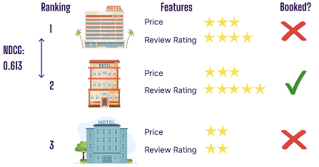
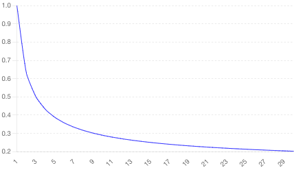
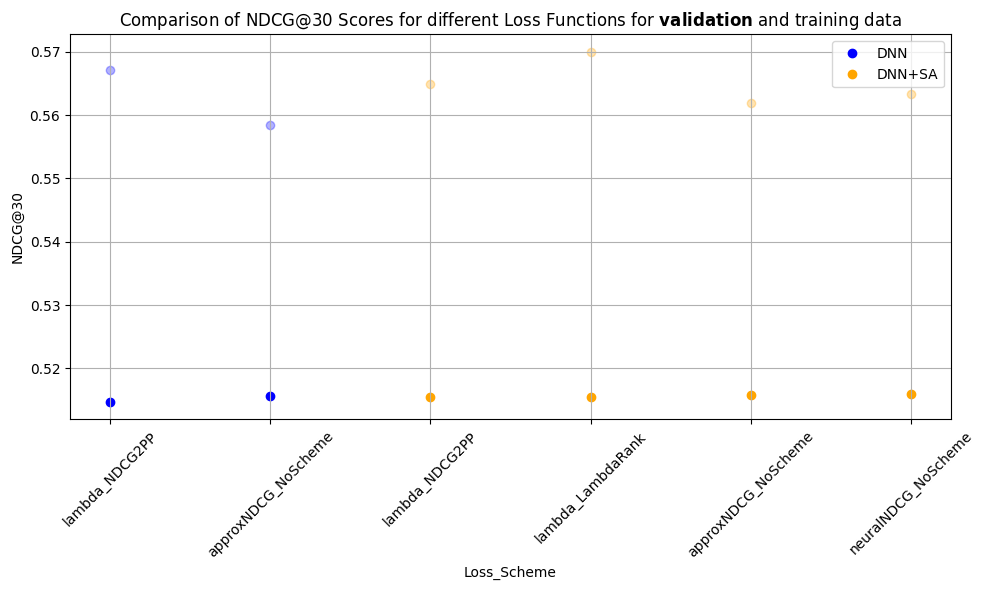

# AI-Powered Hotel Ranking: Streamlining Your Booking Experience

## Project Description
Expedia Group, a prominent online travel agency, streamlines trip planning by providing a platform where users can compare prices, review amenities, and book accommodations through sophisticated recommendation and ranking systems. This project evaluates various machine learning models to efficiently prioritize the most relevant search results, enhancing user satisfaction and booking efficiency.

## Partners
- Expedia Group
- Constructor Academy

## Table of Contents
1. [Problem Statement](#problem-statement)
2. [Project Goal](#project-goal)
3. [Dataset Description](#dataset-description)
4. [Approach and Methodology](#approach-and-methodology)
   - [Machine Learning Models](#machine-learning-models)
   - [Deep Learning Models](#deep-learning-models)
5. [Results](#results)
6. [Future Work](#future-work)
7. [Team Members](#team-members)
8. [Blog Post](#blog-post)
9. [Tools Used](#tools-used)

## Problem Statement
When searching for accommodations, users face an overwhelming number of choices. For example, searching for a "4-star hotel for three adults in Geneva in early May 2024" can yield hundreds of results. Without sorting options based on user-specified features like star rating or number of guests, search times can extend, and bookings can decrease, countering the platform’s objective to simplify travel arrangements.

## Project Goal
The goal of this project is to develop and evaluate supervised machine learning and deep learning models that can rank hotel search results by relevance, thereby improving user satisfaction and booking rates.

## Evaluation Metric

Normalized Discounted Cumulative Gain (NDCG) is a ranking quality metric that compares rankings to an ideal order where all relevant items are at top of the list

|  |  |
|:----------------------------------------:|:----------------------------------------:|
| Figure 1: NDCG shows how relevance of items decreases as their position in the ranking increases         | Figure 2: NDCG as a ranking quality metric         |

## Dataset Description
The Expedia RecTour research dataset used in this project includes 1 million searches over two months in 2021. It contains detailed information on booking details, hotel ratings, review counts, and amenities such as WiFi and parking. We focused on searches that led to clicks or bookings for the top 500 destinations, which helped us significantly reduce the training dataset size.

## Data preprocessing and Feature selection

Refer to doc "Feature_Selection_Documentation.md" for further details
 
- Categorical Features: Target encoding for high-cardinality features.
- Binary Features: One-hot encoding and retention of relevant indicators.
- Ordinal Features: Handling of ratings and rankings.
- Numerical Features: Standard scaling applied.
- Excluded Features: Features used solely for relevance labeling and those with majority null values.

## Feature engineering based upon business logic
Notebook "FeatureEngineeringNewTargetRelevances.ipynb," creates custom features to enhance target relevance. Key steps include:

- Relevance Calculation: Based on user clicks and transactions.
- Categorization: For price buckets and review ratings.
- Combined Features: Integrates clicks, price, ratings, and review counts.
- Target Encoding: Encodes categorical based upon selected/targetrelevance.
- Feature Selection: Chooses and retains the most relevant features.

The saved data can be used for next steps for model training and evaluation

## Machine learning libraries used
- XGBoost
- LightGBM
- NN from sratch
- allRank

### Machine Learning Models
We began with decision tree-based models such as LightGBM and XGBRanker. These models helped us identify key features relevant to the ranking task.

### Deep Learning Models
We then explored the allRank model, an open-source transformer-based model that enhances ranking by understanding the context of other properties. This model demonstrated the best performance on the Expedia RecTour dataset, leveraging a self-attention mechanism to learn item scores in the context of all other items present in the list.

## Results
Our evaluation showed the following:
- **Decision Tree-based Models:** These models effectively identified key features for the ranking task but did not achieve the highest NDCG scores.
- **AllRank Model:** This model performed best in our tests, though it did not yet match the NDCG score of the previously used model.

The results are summarized as follows:
- **NDCG Scores:** The allRank model showed superior performance in placing the most relevant properties higher in the search results.

The DNN+SA model generally outperforms the standard DNN model, highlighting the benefit of incorporating Self-Attention for ranking tasks in the Expedia RecTour dataset.

## Future Work
We have outlined several future steps to enhance our model:
- **Larger Dataset Training:** Expanding the dataset size for training to improve model generalization.
- **Ranking Similarity Comparison:** Comparing the ranking outputs of different models to understand performance variations.
- **Feature Engineering:** Implementing various relevance metrics aligned with business objectives to improve model accuracy further.

#### **Contributing Members**

- __[Guillem Montoya](https://www.linkedin.com/in/guillem-montoya-bb0284195/)__
- __[Kunal Sharma](https://www.linkedin.com/in/drkunalsharma/)__
- __[Lorenz Schmid](https://www.linkedin.com/in/lorenz-schmid-40801b22b/)__
- __[Asterios Raptis](https://www.linkedin.com/in/asterios-raptis-46824a31/)__

## Blog Post
For more details, please read our [blog post](https://academy.constructor.org/blog/data-science-capstone-projects-batch-25).

## Tools Used

- **Pandas** 🐼: Data manipulation and analysis
- **NumPy** 🔢: Numerical computing
- **Matplotlib** 📊: Plotting and visualization
- **tqdm** ⏳: Progress bars for loops
- **timeit** ⏱️: Time measuring tool
- **hashlib** 🔒: Secure hash and message digest
- **Dask** 🏭: Parallel computing with pandas-like syntax
- **gc** 🗑️: Garbage collection interface

### Ranking Algorithms Implemented

- **allRank** 🎯: Learning to rank tool from Allegro
- **XGBRanker** 🌲: XGBoost ranking
- **LightGBM** 💡: Gradient boosting framework

